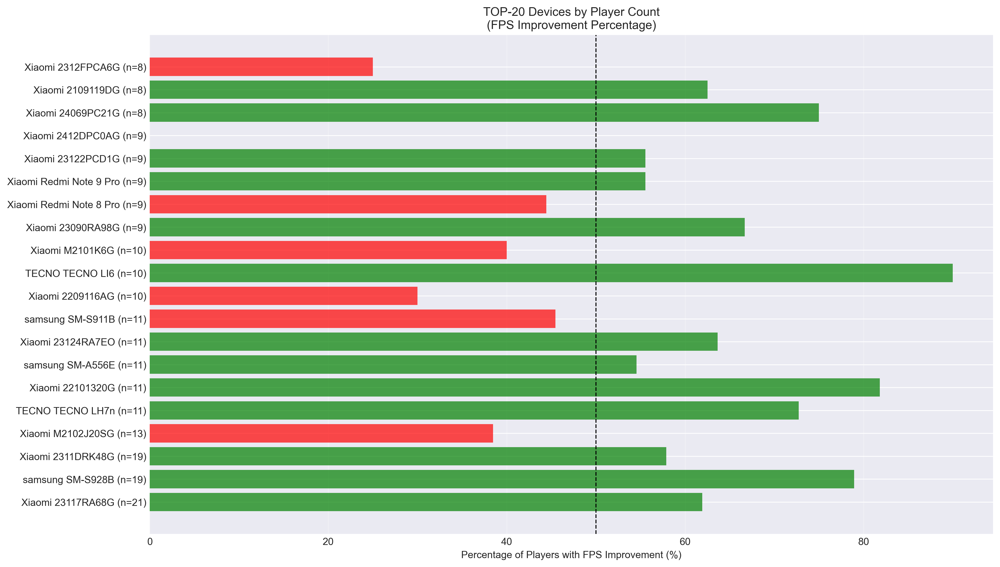
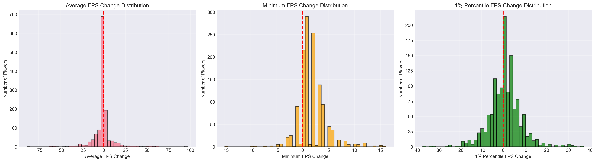
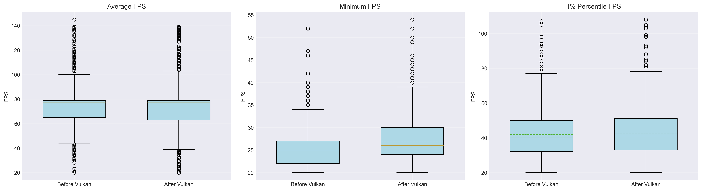
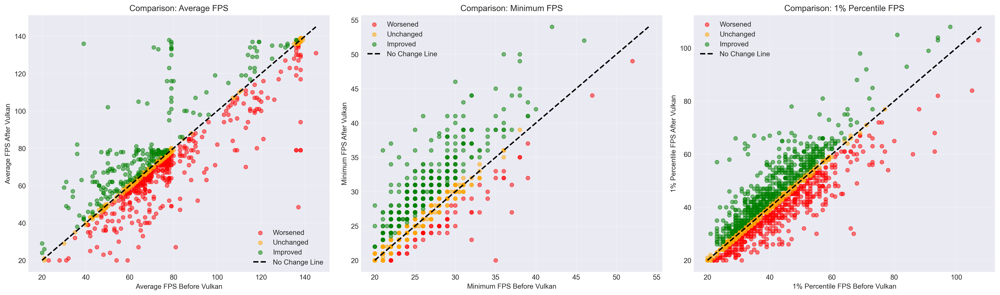

# Vulkan FPS Impact Analysis

**Professional Analytical Research — Gear Games**

## Research Overview

A comprehensive statistical analysis framework developed for Gear Games to evaluate the impact of Vulkan API implementation on mobile gaming performance. This production-grade solution employs rigorous paired statistical testing methodology to identify device-specific performance patterns, enabling data-driven decisions for platform-specific graphics API deployment.

**Business Value:** The analysis directly informs technical decisions on Vulkan enablement/disablement across different device models and GPU families, ensuring optimal player experience while preventing performance degradation for specific hardware configurations.

**Note:** *This repository contains a synthetic data example that preserves the analytical methodology used in production. All sensitive client information has been replaced while maintaining statistical properties and analytical rigor.*

---

## Key Achievements

- **Analyzed 1,298 players** using paired before/after testing methodology
- **Identified 31 device models** with stable FPS improvement (>70% improvement rate)
- **Identified 37 device models** requiring Vulkan rollback (<30% improvement rate)
- **Classified 10 GPU families** for Vulkan enablement and **12 for exclusion**
- **+6.99% minimum FPS improvement** (statistically significant, p<0.001) — critical for gameplay smoothness
- **Generated automated reports** with statistical tests, device/GPU segmentation, and comprehensive visualizations

---

## Technology Stack

- **Python** — Core programming language
- **Pandas & NumPy** — Data manipulation and aggregation
- **SciPy** — Paired t-tests and statistical significance testing
- **Matplotlib & Seaborn** — Professional visualization generation
- **Statistical Analysis** — Hypothesis testing, effect size calculation, confidence intervals

---

# Analysis Report

**Analysis Date:** 2025-10-16 19:10:01

---

## Table of Contents

1. [Task Description](#task-description)
2. [Research Methodology](#research-methodology)
3. [Data Loading and Preparation](#data-loading-and-preparation)
4. [Overall Results](#overall-results)
5. [Statistical Analysis](#statistical-analysis)
6. [Device Analysis](#device-analysis)
7. [GPU Analysis](#gpu-analysis)
8. [Visualizations](#visualizations)
9. [Conclusions and Recommendations](#conclusions-and-recommendations)

---

## Task Description

### Context

Players were offered to take an FPS test:
- **Before Vulkan implementation**: Mission 966
- **After Vulkan implementation**: Mission 967

### Analysis Goals

1. Evaluate the overall effect of Vulkan implementation (FPS improvement or degradation)
2. Identify devices for which the effect is consistently positive/negative
3. Identify GPUs for which the effect is consistently positive/negative

---

## Research Methodology

### Stage 1: Player Identification for Comparison

**Approach:**
- From the entire dataset, players who took the test BEFORE (mission 966) and AFTER (mission 967) Vulkan implementation are identified
- This ensures paired comparison, which is critical for correct effect evaluation
- Players who took only one test are excluded from analysis

**Rationale:**
- Paired comparison eliminates individual player variability
- Allows isolating the effect specifically from Vulkan implementation, not from differences in player skills or behavior

### Stage 2: Data Aggregation

**Approach:**
- Each player may have multiple measurements within one mission
- Median value is used for player data aggregation
- Median is chosen over mean for robustness to outliers

**FPS Metrics:**
- `c_FpsAvg` - average FPS per session
- `c_FpsAvgMin` - minimum average FPS (important for evaluating "dips")
- `c_FpsAvgOnePercentile` - 1% percentile (shows worst 1% of moments)

### Stage 3: Change Calculation

**Approach:**
- For each metric, the following are calculated:
  - Absolute change: `Δ = FPS_after - FPS_before`
  - Percentage change: `Δ% = (Δ / FPS_before) × 100%`

**Change Evaluation Criteria:**
- For each player, 3 key metrics are evaluated:
  - Average FPS (`c_FpsAvg`)
  - Minimum FPS (`c_FpsAvgMin`)
  - 1% Percentile FPS (`c_FpsAvgOnePercentile`)

- **Significant change threshold:** 1.0 FPS
  - Improvement: Δ > 1.0 FPS
  - No change: |Δ| ≤ 1.0 FPS  
  - Worsening: Δ < -1.0 FPS

- **Overall player evaluation:**
  - **Improvement**: if 2/3 metrics improved OR if 1/3 improved + 2/3 unchanged
  - **No change**: if 3/3 metrics unchanged
  - **Worsening**: in all other cases

### Stage 4: Statistical Analysis

**Approach:**
- Paired Student's t-test is applied
- Hypothesis tested: H0: mean change = 0 vs H1: mean change ≠ 0
- Significance level: α = 0.05

**Rationale:**
- Paired t-test is suitable for comparing two related samples (before/after)
- p-value < 0.05 indicates statistically significant change

### Stage 5: Device Analysis

**Approach:**
- Data is aggregated by device models (`DeviceModel`)
- For each device, the following are calculated:
  - Number of players
  - Mean changes in key FPS metrics
  - Percentage of players with improvement (`improvement_rate`)

**Filtering Criteria:**
- Only devices with **minimum 3 players** are analyzed (for statistical significance)

**Classification Criteria:**
- **Stable improvement**: improvement_rate > 70.0%
- **Stable worsening**: improvement_rate < 30.0%
- **Neutral effect**: 30.0% ≤ improvement_rate ≤ 70.0%

### Stage 6: GPU Analysis

**Approach:**
- Similar to device analysis, but aggregated by GPU (`c_GraphicsDeviceName`)
- Same filtering and classification criteria are applied

**Rationale:**
- Vulkan is a graphics API, so the effect may strongly depend on GPU architecture
- Important to identify GPUs where Vulkan shows best/worst optimization

---
## Data Loading and Preparation

### Source Data

- **Source:** `offer_fps.csv` and `client_info.csv`
- **Total records:** 6211
- **Records before Vulkan (mission 966):** 3777
- **Records after Vulkan (mission 967):** 2434

### Player Matching

- **Unique players before:** 1298
- **Unique players after:** 2077
- **Players who took both tests:** 1298

### Pair Validation

- **Valid players (with Vulkan on mission 967):** 1298

### Analysis Data

- **Players in final sample:** 1298
- **Records before (matched):** 1349
- **Records after (matched):** 1336

---
## Overall Results

### Effect Distribution

| Result | Player Count | Percentage |
|--------|-------------|------------|
| 🟢 Improvement | 635 | 48.9% |
| 🟡 No Change | 91 | 7.0% |
| 🔴 Worsening | 572 | 44.1% |
| **Total** | **1298** | **100.0%** |

### Statistics by Key Metrics

#### 1. Average FPS (c_FpsAvg)

| Period | Mean | Std Dev |
|--------|------|---------|
| Before Vulkan | 75.18 | 20.49 |
| After Vulkan | 74.36 | 21.08 |
| **Change (Δ)** | **-0.82** | **11.30** |
| **Change (%)** | **-1.10%** | - |

#### 2. Minimum FPS (c_FpsAvgMin)

| Period | Mean | Std Dev |
|--------|------|---------|
| Before Vulkan | 25.24 | 3.69 |
| After Vulkan | 27.00 | 4.75 |
| **Change (Δ)** | **1.76** | **2.67** |
| **Change (%)** | **6.99%** | - |

#### 3. 1% Percentile FPS (c_FpsAvgOnePercentile)

| Period | Mean | Std Dev |
|--------|------|---------|
| Before Vulkan | 41.85 | 12.49 |
| After Vulkan | 42.64 | 13.20 |
| **Change (Δ)** | **0.79** | **7.40** |
| **Change (%)** | **1.88%** | - |

---
## Statistical Analysis

### Paired Student's t-test

Tests the hypothesis about significance of FPS change after Vulkan implementation.

**Null hypothesis (H0):** Mean FPS change = 0 (no effect)  
**Alternative hypothesis (H1):** Mean FPS change ≠ 0 (there is an effect)  
**Significance level:** α = 0.05

#### Average FPS

| Parameter | Value |
|-----------|-------|
| t-statistic | -2.6288 |
| p-value | 0.008670 |
| Direction | ↓ Worsening |
| Result | ✅ **STATISTICALLY SIGNIFICANT** |

#### Minimum FPS

| Parameter | Value |
|-----------|-------|
| t-statistic | 23.7962 |
| p-value | 0.000000 |
| Direction | ↑ Improvement |
| Result | ✅ **STATISTICALLY SIGNIFICANT** |

#### 1% Percentile FPS

| Parameter | Value |
|-----------|-------|
| t-statistic | 3.8276 |
| p-value | 0.000136 |
| Direction | ↑ Improvement |
| Result | ✅ **STATISTICALLY SIGNIFICANT** |

### Interpretation

- **p-value < 0.05** means the change is statistically significant (probability of randomness < 5%)
- **t-statistic > 0** indicates positive change (improvement)
- **t-statistic < 0** indicates negative change (worsening)

---
## Device Analysis

### Methodology

- **Minimum players for analysis:** 3
- **Stable improvement criterion:** >70.0% of players showed improvement
- **Stable worsening criterion:** <30.0% of players showed improvement

### 🟢 Devices with Stable Improvement

**Count:** 31

| # | Name | Players | % Improved | Before (AVG) | After (AVG) | Δ (AVG) |
|---|---|---|---|---|---|---|
| 1 | samsung SM-S928B | 19 | 78.9% | 89.3 | 92.4 | +3.13 |
| 2 | TECNO TECNO LH7n | 11 | 72.7% | 72.0 | 75.5 | +3.55 |
| 3 | Xiaomi 22101320G | 11 | 81.8% | 74.5 | 78.7 | +4.27 |
| 4 | TECNO TECNO LI6 | 10 | 90.0% | 69.0 | 73.7 | +4.70 |
| 5 | Xiaomi 24069PC21G | 8 | 75.0% | 103.8 | 107.5 | +3.75 |
| 6 | Xiaomi 23049PCD8G | 8 | 87.5% | 96.9 | 94.8 | -2.12 |
| 7 | samsung SM-A715F | 7 | 100.0% | 67.4 | 72.0 | +4.57 |
| 8 | samsung SM-A556B | 7 | 71.4% | 82.9 | 82.7 | -0.14 |
| 9 | samsung SM-S938B | 7 | 100.0% | 112.7 | 112.9 | +0.14 |
| 10 | Xiaomi 23053RN02Y | 7 | 85.7% | 40.7 | 45.3 | +4.57 |
| 11 | samsung SM-S721B | 7 | 71.4% | 104.0 | 105.4 | +1.43 |
| 12 | samsung SM-S918B | 6 | 83.3% | 78.7 | 88.8 | +10.17 |
| 13 | HONOR REA-NX9 | 6 | 83.3% | 84.3 | 87.0 | +2.67 |
| 14 | Xiaomi 23113RKC6G | 5 | 80.0% | 114.0 | 102.8 | -11.20 |
| 15 | samsung SM-F956B | 4 | 75.0% | 120.8 | 121.8 | +1.00 |
| 16 | TECNO TECNO LG7n | 4 | 100.0% | 74.0 | 74.0 | +0.00 |
| 17 | samsung SM-S711B | 4 | 75.0% | 78.5 | 78.0 | -0.50 |
| 18 | INFINIX Infinix X6833B | 4 | 75.0% | 68.5 | 68.8 | +0.25 |
| 19 | Xiaomi 23021RAAEG | 4 | 75.0% | 62.0 | 61.5 | -0.50 |
| 20 | INFINIX Infinix X6871 | 4 | 75.0% | 79.0 | 79.0 | +0.00 |

### 🔴 Devices with Stable Worsening

**Count:** 37

| # | Name | Players | % Improved | Before (AVG) | After (AVG) | Δ (AVG) |
|---|---|---|---|---|---|---|
| 1 | Xiaomi 2412DPC0AG | 9 | 0.0% | 107.8 | 96.8 | -11.00 |
| 2 | Xiaomi 2312FPCA6G | 8 | 25.0% | 76.9 | 70.5 | -6.38 |
| 3 | samsung SM-A346E | 7 | 14.3% | 92.9 | 87.9 | -5.00 |
| 4 | Xiaomi 23043RP34G | 7 | 28.6% | 96.6 | 95.1 | -1.43 |
| 5 | HONOR ALI-NX1 | 7 | 28.6% | 78.7 | 78.7 | +0.00 |
| 6 | samsung SM-A515F | 7 | 28.6% | 62.9 | 60.4 | -2.43 |
| 7 | realme RMX3834 | 6 | 16.7% | 57.0 | 58.7 | +1.67 |
| 8 | Xiaomi 24090RA29G | 6 | 16.7% | 100.5 | 89.8 | -10.67 |
| 9 | Xiaomi 2406APNFAG | 5 | 0.0% | 125.4 | 123.8 | -1.60 |
| 10 | samsung SM-X200 | 5 | 0.0% | 64.4 | 60.4 | -4.00 |
| 11 | Xiaomi 23073RPBFG | 5 | 0.0% | 65.6 | 62.2 | -3.40 |
| 12 | TECNO TECNO KI7 | 5 | 20.0% | 61.6 | 57.0 | -4.60 |
| 13 | Xiaomi 22126RN91Y | 4 | 25.0% | 51.5 | 48.5 | -3.00 |
| 14 | HONOR CRT-NX1 | 4 | 25.0% | 72.2 | 74.2 | +2.00 |
| 15 | realme RMX3195 | 4 | 0.0% | 56.2 | 48.2 | -8.00 |
| 16 | TECNO TECNO LI7 | 4 | 25.0% | 78.2 | 67.8 | -10.50 |
| 17 | samsung SM-A137F | 4 | 0.0% | 64.8 | 56.5 | -8.25 |
| 18 | samsung SM-A336E | 4 | 25.0% | 82.8 | 73.2 | -9.50 |
| 19 | realme RMX3871 | 4 | 0.0% | 69.4 | 65.8 | -3.62 |
| 20 | HONOR NTH-NX9 | 4 | 25.0% | 98.8 | 90.8 | -8.00 |

### TOP-20 Devices by Player Count

---
## GPU Analysis

### Methodology

- **Minimum players for analysis:** 3
- **Stable improvement criterion:** >70.0% of players showed improvement
- **Stable worsening criterion:** <30.0% of players showed improvement

### 🟢 GPUs with Stable Improvement

**Count:** 10

| # | Name | Players | % Improved | Before (AVG) | After (AVG) | Δ (AVG) |
|---|---|---|---|---|---|---|
| 1 | Adreno (TM) 750 | 36 | 86.1% | 95.6 | 98.0 | +2.46 |
| 2 | Adreno (TM) 730 | 28 | 75.0% | 82.9 | 86.9 | +4.05 |
| 3 | Adreno (TM) 830 | 25 | 72.0% | 99.0 | 96.4 | -2.64 |
| 4 | Adreno (TM) 735 | 14 | 78.6% | 94.3 | 96.6 | +2.36 |
| 5 | Mali-G610 MC6 | 13 | 84.6% | 75.6 | 74.8 | -0.85 |
| 6 | Adreno (TM) 725 | 11 | 90.9% | 91.8 | 90.5 | -1.36 |
| 7 | ANGLE (Samsung Xclipse 920) on Vulkan 1.3.279 | 9 | 88.9% | 78.4 | 84.4 | +6.00 |
| 8 | Adreno (TM) 720 | 5 | 80.0% | 78.8 | 79.0 | +0.20 |
| 9 | PowerVR Rogue GE8320 | 5 | 80.0% | 37.6 | 73.6 | +36.00 |
| 10 | Adreno (TM) 612 | 3 | 100.0% | 69.3 | 72.3 | +3.00 |

### 🔴 GPUs with Stable Worsening

**Count:** 12

| # | Name | Players | % Improved | Before (AVG) | After (AVG) | Δ (AVG) |
|---|---|---|---|---|---|---|
| 1 | Mali-G57 | 62 | 27.4% | 60.7 | 58.7 | -2.00 |
| 2 | Mali-G68 | 33 | 27.3% | 81.0 | 75.9 | -5.09 |
| 3 | Mali-G72 | 23 | 26.1% | 62.5 | 59.0 | -3.48 |
| 4 | Mali-G51 | 14 | 21.4% | 59.7 | 60.6 | +0.86 |
| 5 | Mali-G720 MC7 | 10 | 0.0% | 104.9 | 94.9 | -10.00 |
| 6 | Mali-G71 | 6 | 16.7% | 51.3 | 42.0 | -9.33 |
| 7 | PowerVR Rogue GE8322 | 6 | 16.7% | 38.3 | 37.3 | -1.00 |
| 8 | Mali-G72 MP3 | 4 | 25.0% | 66.5 | 63.2 | -3.25 |
| 9 | Mali-G57 MC3 | 4 | 0.0% | 59.2 | 54.0 | -5.25 |
| 10 | Mali-G710 MC10 | 4 | 25.0% | 78.2 | 78.8 | +0.50 |
| 11 | Mali-G715-Immortalis MC11 | 3 | 0.0% | 79.0 | 78.7 | -0.33 |
| 12 | PowerVR B-Series BXM-8-256 | 3 | 0.0% | 75.7 | 67.3 | -8.33 |

### TOP-20 GPUs by Player Count

---
## Visualizations

### FPS Change Distribution

**Interpretation:**
- Histograms show the distribution of changes for three key metrics
- Red dashed line (x=0) separates improvement and worsening
- Distribution shift to the right of zero indicates overall improvement
- Shift to the left indicates worsening

### Before/After Comparison (Box Plot)

**Interpretation:**
- Box plot shows median, quartiles, and outliers
- Allows visual assessment of central tendency and spread changes
- Green line inside boxes - mean value

### Scatter Plot: Before vs After

**Interpretation:**
- Three plots for comparison: Average FPS, Minimum FPS, 1% Percentile FPS
- Each point represents one player
- Black dashed line - "no change" line (y=x)
- Green points - improvement for corresponding metric (Δ > 1.0 FPS)
- Orange points - no change for corresponding metric (|Δ| ≤ 1.0 FPS)
- Red points - worsening for corresponding metric (Δ < -1.0 FPS)
- Point color is determined independently for each metric (by its delta)

---
## Conclusions and Recommendations

### Overall Conclusions

**Overall effect of Vulkan implementation: MIXED**

The analysis reveals a nuanced picture of Vulkan's impact across different hardware configurations:

1. **Audience coverage:**
   - 1,298 players participated in the analysis
   - 635 players (48.9%) showed FPS improvement
   - 91 players (7.0%) remained unchanged
   - 572 players (44.1%) showed FPS worsening

2. **Key findings by metrics:**
   - Average FPS: -0.82 FPS (-1.10%) — slight worsening
   - Minimum FPS: +1.76 FPS (+6.99%) — **significant improvement**
   - 1% Percentile FPS: +0.79 FPS (+1.88%) — improvement
   
   *Note: percentage change = (delta) / (before value) × 100%*

3. **Statistical significance:**
   - Average FPS: statistically significant decrease (p=0.008670)
   - Minimum FPS: statistically significant improvement (p<0.001)
   - 1% Percentile FPS: statistically significant improvement (p=0.000136)

### Device & GPU Segmentation Results

The analysis identified three distinct device categories:

**Devices requiring Vulkan enablement:**
- Show stable FPS improvement
- Examples: samsung SM-S928B, Adreno (TM) 750, Adreno (TM) 730
- Recommended action: **Enable Vulkan**

**Devices requiring Vulkan exclusion:**
- Show stable FPS degradation
- Examples: Xiaomi 2412DPC0AG, Mali-G57, Mali-G68
- Recommended action: **Disable Vulkan**

**Trade-off category:**
- Some devices show slight average FPS decrease but **significant improvement in FPS stability**
- Minimum FPS improved by +6.99%
- 1% Percentile FPS improved by +1.88%
- Recommended action: **Enable Vulkan** — the improvement in FPS stability outweighs minor average FPS reduction

For each category, detailed tables are generated with the ability to view changes for each device group and for each individual player. This enables data-driven decisions at the level of specific device models and GPU families.

